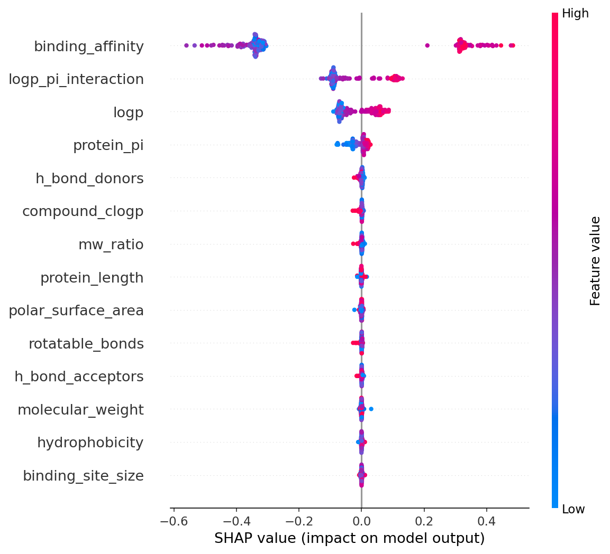

# 💊 Drug Discovery Virtual Screening — ML Classification Pipeline

## 🧬 Project Overview

This project applies machine learning to **virtual drug screening** — 
the process of identifying which chemical compounds are likely to be 
biologically active against a target protein.

Using molecular and protein features, three classification models were 
trained and compared. SHAP (Explainable AI) was used to interpret which 
features drive the predictions — a critical requirement in pharmaceutical research.

📊 **Dataset:** [Drug Discovery Virtual Screening Dataset](https://www.kaggle.com/datasets/shahriarkabir/drug-discovery-virtual-screening-dataset) — 2,000 compounds, 14 molecular features

---

## 🔬 Key Results

| Model | Accuracy | F1 (Active) | Precision | Recall |
|---|---|---|---|---|
| Logistic Regression | 98% | 0.98 | 0.98 | 0.97 |
| **Random Forest** | **100%** | **1.00** | **1.00** | **1.00** |
| XGBoost | 99% | 0.99 | 1.00 | 0.98 |

> ⚠️ Random Forest's perfect score may reflect overfitting on this 
> synthetic dataset. XGBoost (99%) is considered the most reliable result.

---

## 🔍 Explainability — SHAP Analysis

SHAP values reveal that **`binding_affinity`** is by far the most 
important predictor, followed by **`logp_pi_interaction`** and **`logp`**.  
This is biologically meaningful — binding affinity directly determines 
whether a compound can interact with its target receptor.

---

## ⚙️ Pipeline
